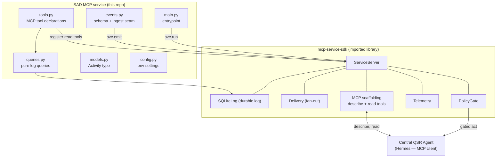
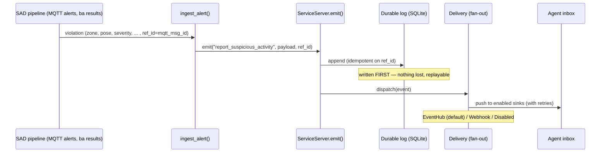
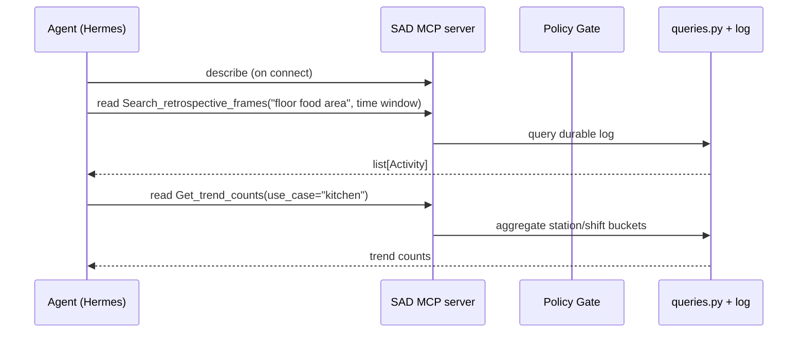

# SAD MCP Service — Integration Guide

How the **Suspicious Activity Detection (SAD) MCP service** is built on the generic
`mcp-service-sdk` library, how it exposes tools to the Central QSR Agent, and how
events fan out from the SAD pipeline to the agent.

- **Service name:** `suspicious_activity`
- **Built on:** `mcp-service-sdk` from `edge-ai-libraries/libraries/mcp-service-sdk`
- **MCP SDK:** official `mcp` (2.x, `MCPServer`)
- **Location:** `storewide-loss-prevention/suspicious-activity-detection/mcp-service`

---

## 1. What this service is

The SAD pipeline (YOLO-pose + VLM behavioral analysis) detects suspicious or
unsafe activity in camera zones. This MCP service makes those detections available
to the agent through the **uniform Service Contract**: the agent describes the
service and reads durable history. Runtime actions are intentionally not exposed;
zone and rule setup is configuration.

The service supports both current SAD scenarios:

- **Retail:** existing suspicious-activity events such as loitering and concealment.
- **Kitchen:** food-safety events from the `kitchen-prep` SceneScape zone, pose
  trigger `floor_to_food_area`, and VLM confirmation that an item was picked from
  the floor and placed back in the food area.

The service writes **only domain code** — its event schema, query helpers, and
tool declarations. Everything else (durable log, event delivery/fan-out,
telemetry, MCP scaffolding) is inherited from `mcp-service-sdk`.

---

## 2. How it connects to the generic `mcp-service-sdk`

`mcp-service-sdk` is a **library**, not a running server. This service imports it,
creates one `ServiceServer`, registers its tools, and runs it — that instance *is*
the MCP server the agent connects to.



**Dependency wiring** (`pyproject.toml`):

```toml
dependencies = [
  "mcp-service-sdk[mcp] @ git+https://github.com/sachinkaushik/edge-ai-libraries.git@mcp#subdirectory=libraries/mcp-service-sdk",
]
```

The `[mcp]` extra pulls in the official MCP SDK. Pin this to a tag or commit in
`edge-ai-libraries` for reproducible builds.

---

## 3. Package structure

| File | Responsibility |
|---|---|
| `src/tools.py` | **The MCP tools** — creates `svc = ServiceServer(...)`, declares read tools, disables subscribe by default, and exposes `ingest_alert`. Edit this to add/change tools. |
| `src/queries.py` | Internal pure query logic over the durable log. Not exposed to the agent. |
| `src/events.py` | Event type name + payload schema + `ingest_alert` (the pipeline hand-off seam). |
| `src/models.py` | `Activity` `TypedDict` — structured output type. |
| `src/config.py` | Env-driven settings (store id, transport, host, port). |
| `src/main.py` | Entrypoint / console script (`sad-mcp`). |
| `scripts/demo_e2e.py` | End-to-end demo (no MCP client needed). |
| `tests/test_queries.py` | Unit tests for the query helpers. |

---

## 4. The Service Contract (what the agent sees)

This service exposes describe + read tools. Subscribe/callback and runtime act
tools are disabled for the food-safety sensor contract.

| Capability | This service |
|---|---|
| **describe** | Advertises the `report_suspicious_activity` event schema + all read tools with descriptions. |
| **read tools** | `Get_all_activities`, `Get_activity_by_zone`, `Get_activity_by_zone_timestamp`, `Search_retrospective_frames`, `Get_trend_counts`, `Get_all_zones`. |
| **subscribe** | Disabled by default (`SAD_EXPOSE_SUBSCRIBE=false`). |
| **act tools** | None at runtime. Kitchen zone/rule setup is configuration under `configs/usecase/kitchen/`. |

### Read tools

| Tool | Params | Returns |
|---|---|---|
| `Get_all_activities` | — | `list[Activity]` — every recorded activity |
| `Get_activity_by_zone` | `zone` | activities in that zone |
| `Get_activity_by_zone_timestamp` | `zone`, `start_ms?`, `end_ms?` | zone activities in an epoch-ms range |
| `Search_retrospective_frames` | `query?`, `start_ms?`, `end_ms?`, `zone?`, `event_name?`, `use_case?` | matching events with SeaweedFS frame references |
| `Get_trend_counts` | `start_ms?`, `end_ms?`, `event_name?`, `use_case?` | counts grouped by station and shift |
| `Get_all_zones` | — | distinct zones with activity |

Descriptions come from the function **docstrings**; parameter docs from
`Annotated[..., Field(description=...)]` — the standard MCP convention.

### Runtime actions

No runtime action tools are exposed. For kitchen food-safety, aiming the zone,
setting the pose trigger, and enabling VLM confirmation are controlled by these
configuration files:

| File | Kitchen setting |
|---|---|
| `configs/usecase/kitchen/scene-config.yaml` | Scene `kitchen food safety`, zone `kitchen-prep: HIGH_VALUE`. |
| `configs/usecase/kitchen/patterns.yaml` | Pose pattern `floor_to_food_area` with VLM confirmation prompt. |
| `configs/usecase/kitchen/rules.yaml` | Emits `FOOD_SAFETY_VIOLATION` when BA/VLM status is suspicious. |

### The `Activity` shape

```python
class Activity(TypedDict):
    ref_id: str        # source event id (MQTT message id) — idempotent
    ts_ms: int         # epoch milliseconds
  event_name: str    # food_safety_violation, loitering, concealment, ...
  use_case: str      # retail | kitchen
    zone: str
    pose: str          # reach-over, item-conceal, slip, ...
    severity: str      # low | medium | high
    camera_id: str
    object_id: str     # SceneScape cross-camera person id
    description: str    # VLM one-line summary
  frame: str          # SeaweedFS frame/object reference
  station: str        # prep, checkout, etc.
  shift: str          # breakfast, lunch, dinner, overnight, unknown
```

Kitchen food-safety events use the generic event type
`report_suspicious_activity` with payload `event_name="food_safety_violation"`,
`zone="kitchen-prep"`, and `description`/`frame` pointing to the VLM-confirmed
evidence.

---

## 5. How events fan out (SAD pipeline → agent)

The SAD MQTT consumer publishes a violation by calling **one function**,
`ingest_alert(...)`. From there `mcp-service-sdk` does *emit-to-log-first, then
fan out*:



Key properties:

- **Log first.** The event is persisted to the service's own durable log *before*
  any delivery — so nothing is dropped and the whole run is replayable for
  benchmarking/debugging.
- **Idempotent.** `ref_id` = the MQTT message id; a redelivered message is stored
  once, never double-counted.
- **Fan-out sinks** (chosen by config in `mcp-service-sdk`):
  - **EventHub** (default) — de-dupes, fans out, retries; the agent inbox listens here.
  - **Webhook** — HTTP callback for partners / other agent frameworks.
  - **Disabled** — clean benchmark runs (log only, no delivery).
- **Bounded retries.** Failed deliveries are retried with backoff; nothing fails silently.

### Wiring the pipeline (the seam)

```python
from tools import ingest_alert   # from src/tools.py

ingest_alert(
    zone="kitchen-prep",
    pose="floor_to_food_area",
    severity="critical",
    camera_id="lp-camera1",
    object_id="p-1001",
    description="Item picked from floor and placed back in the food area",
    ref_id=mqtt_message_id,     # -> idempotent replay
    event_name="food_safety_violation",
    use_case="kitchen",
    frame="s3://behavioral-frames/.../frame.jpg",
    station="prep",
    shift="lunch",
)
```

Drop this call into the SAD MQTT consumer (`behavioral-analysis/src`) wherever a
result/alert is produced.

---

## 6. How the agent reads and acts



The agent connects as a standard MCP client. Because the contract is uniform,
onboarding this service needs **no agent code changes** — it discovers everything
via `describe`.

---

## 7. How it runs

The service runs as a **host process** (no container image to maintain), managed
by the Makefile and started/stopped with the main stack.

| Command | Effect |
|---|---|
| `make up USE_CASE=retail` | Brings up the retail SAD stack and the SAD MCP service. |
| `make up USE_CASE=kitchen` | Brings up the kitchen food-safety stack and the SAD MCP service. |
| `make down` | Stops the stack and the MCP service container. |

Details:

- **Transport:** `streamable-http` in deployment (so the agent can reach it over
  the network); `stdio` locally for CLI use.
- **Endpoint:** `http://localhost:9000/mcp` (override port with `MCP_PORT`).
- **Container:** compose service `sad-mcp-service`, image `intel/sad-mcp:${TAG}`.
- **Log volume:** Docker volume `sad-mcp-data` at `/data/sad_log.sqlite`.

> **Networking note:** the agent reaches this at `http://<host>:9000/mcp`. If Hermes
> runs inside the compose network, use the host address (e.g. `host.docker.internal:9000`)
> rather than a compose service DNS name, since this is a host process, not a container.

---

## 8. Configuration (env vars)

| Var | Default | Meaning |
|---|---|---|
| `STORE_ID` | `store_001` | Store identity stamped on every event. |
| `MCP_TRANSPORT` | `stdio` | `stdio` \| `sse` \| `streamable-http`. Makefile sets `streamable-http`. |
| `MCP_HOST` | `0.0.0.0` | Bind host for HTTP transports. |
| `MCP_PORT` | `9000` | Bind port for HTTP transports. |
| `SAD_EXPOSE_SUBSCRIBE` | `false` | Keep callback subscription disabled for the read-only sensor contract. |
| `SAD_DELIVERY` | `off` | `off` or `webhook`; when `webhook`, events are pushed after durable-log append. |
| `SAD_WEBHOOK_URL` | — | Hub/webhook endpoint used when `SAD_DELIVERY=webhook`. |
| `SEED_DEMO` | `false` | Optional local demo history seeding; production/default startup uses real events only. |

---

## 9. Develop & verify

```bash
cd mcp-service
python3 -m venv .venv
.venv/bin/pip install -e .        # installs mcp-service-sdk from edge-ai-libraries + this package

# run the server
.venv/bin/sad-mcp                 # stdio; set MCP_TRANSPORT=streamable-http for HTTP

# tests + demo (no MCP client needed)
.venv/bin/python -m pytest -q tests/
.venv/bin/python scripts/demo_e2e.py
```

For a no-install local smoke against the checked-out SDK source:

```bash
PYTHONPATH=src:/home/intel/sachin/oep/edge-ai-libraries/libraries/mcp-service-sdk/src \
  python scripts/demo_e2e.py
```

---

## 10. Versioning

- This service consumes `mcp-service-sdk` from the `edge-ai-libraries` repository subdirectory.
- `make mcp-up` runs `pip install -e` every start, so bumping the pin here is picked up automatically.
- When an internal package registry exists, swap the git URL for `mcp-service-sdk[mcp]==<version>`.

---

## 11. Summary

- The SAD service is a **thin instance** of the generic `mcp-service-sdk` contract.
- It writes only its **schema + query helpers + tool declarations**; the base
  provides the log, fan-out, policy gate, telemetry, and MCP scaffolding.
- Events flow **pipeline → `ingest_alert` → emit → durable log (first) → optional fan-out → agent**,
  idempotent on `ref_id` and fully replayable.
- The agent connects over MCP and discovers describe/read tools via `describe` —
  no agent changes needed to onboard this service.
